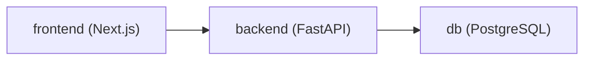

# DockerScripts

[](https://docs.docker.com/compose/)
[](https://www.gnu.org/software/bash/)
[](https://nextjs.org/docs)
[](https://fastapi.tiangolo.com/)
[](https://www.prisma.io/docs)

Opinionated Bash automation scripts for creating full-stack, containerized developer environments in minutes.

## Table of Contents

- [Overview](#overview)
- [Repository Layout](#repository-layout)
- [What the Scripts Do](#what-the-scripts-do)
- [Script Comparison](#script-comparison)
- [Prerequisites](#prerequisites)
- [Quick Start](#quick-start)
- [Generated Environment](#generated-environment)
- [How This Improves Productivity](#how-this-improves-productivity)
- [Usage Guidelines](#usage-guidelines)
- [Troubleshooting](#troubleshooting)
- [Tech Stack Links](#tech-stack-links)

## Overview

This repository provides project bootstrap scripts that:

- scaffold a FastAPI + Next.js full-stack app
- provision PostgreSQL with Docker Compose
- configure Prisma for Python
- seed initial data
- launch local containers ready for development

The goal is to remove repetitive setup work and give teams a consistent local environment from day one.

## Repository Layout

```text
DockerScripts/
├── README.md
└── scripts/
    ├── docker_pyNext
    ├── docker_pyNext_v2
    ├── docker_pyNext_v3
    └── NextPY-Docscript.md
```

## What the Scripts Do

Each script takes a project name and creates a new directory with:

- `backend/` (FastAPI service)
- `frontend/` (Next.js app)
- `backend/prisma/schema.prisma` (data model)
- `docker-compose.yml` (db + backend + frontend services)
- seed/test boilerplate for quick verification

During execution, scripts also:

- prompt before overwriting existing folders
- build and start containers
- wait for database readiness before finishing

## Script Comparison

| Script | Best For | Notable Behavior |
| --- | --- | --- |
| `scripts/docker_pyNext` | Base scaffold | Creates users + training endpoints and basic frontend scaffold |
| `scripts/docker_pyNext_v2` | Enhanced UI scaffold | Adds modern users dashboard with Framer Motion |
| `scripts/docker_pyNext_v3` | Most stable/default choice | Improves generated test compatibility, API base configuration, and startup robustness |

Recommendation: start with `scripts/docker_pyNext_v3` unless you specifically need an older variant.

## Prerequisites

Install these on your machine before running scripts:

- [Docker Desktop](https://www.docker.com/products/docker-desktop/) (or Docker Engine)
- [Docker Compose](https://docs.docker.com/compose/)
- [Bun](https://bun.sh/docs/installation)
- `bash` shell
- Internet access (for pulling images/packages)

## Quick Start

Run from repository root:

```bash
bash scripts/docker_pyNext_v3 my-app
```

Alternative variants:

```bash
bash scripts/docker_pyNext my-app
bash scripts/docker_pyNext_v2 my-app
```

After completion:

- Frontend: [http://localhost:3000](http://localhost:3000)
- Backend: [http://localhost:8000/users](http://localhost:8000/users)
- API docs (v3): [http://localhost:8000/docs](http://localhost:8000/docs)

## Generated Environment

Typical output structure:

```text
my-app/
├── docker-compose.yml
├── backend/
│   ├── .env
│   ├── Dockerfile
│   ├── requirements.txt
│   ├── seed.py
│   ├── prisma/
│   │   └── schema.prisma
│   └── app/
│       ├── main.py
│       ├── database.py
│       ├── hooks/
│       └── tests/
└── frontend/
    ├── package.json
    ├── next.config.js
    └── app/
```

Runtime services:



## How This Improves Productivity

- Faster onboarding: new developers can run one command and start coding.
- Consistent environments: everyone runs the same service topology and base config.
- Less manual setup: Docker, backend, frontend, schema, and seed steps are automated.
- Faster feedback loop: generated tests and seeded data provide immediate validation.
- Lower setup drift: scripted project generation reduces per-developer variation.

## Usage Guidelines

- Run scripts from the repository root.
- Use unique project names to avoid accidental directory conflicts.
- Read prompts carefully when `Overwrite`, `Keep`, or `Delete` options appear.
- Prefer v3 for new work unless legacy behavior is required.
- Commit generated projects separately from this scripts repository.

## Troubleshooting

- `bun: command not found`: install Bun and re-run.
- Docker daemon unavailable: start Docker Desktop/Engine and retry.
- Port conflicts (`3000`, `5432`, `8000`): stop conflicting services or adjust compose ports.
- Frontend build issues: inside generated project, run `docker-compose logs -f frontend`.
- Backend startup issues: run `docker-compose logs -f backend` and check DB readiness.

## Tech Stack Links

- [FastAPI](https://fastapi.tiangolo.com/)
- [Next.js](https://nextjs.org/docs)
- [Prisma Client Python](https://prisma-client-py.readthedocs.io/)
- [PostgreSQL](https://www.postgresql.org/docs/)
- [Docker Compose](https://docs.docker.com/compose/)
