# DockerScripts

[](https://docs.docker.com/compose/)
[](https://www.gnu.org/software/bash/)
[](https://nextjs.org/docs)
[](https://fastapi.tiangolo.com/)
[](https://www.prisma.io/docs)
[](https://www.postgresql.org/docs/)

Opinionated Bash automation scripts that spin up full-stack, containerized developer environments in minutes. ✨

## Table of Contents

- [Overview](#overview)
- [What These Scripts Do](#what-these-scripts-do)
- [Script Options](#script-options)
- [Prerequisites](#prerequisites)
- [Quick Start](#quick-start)
- [Generated Developer Environment](#generated-developer-environment)
- [Testing](#testing)
- [Docker Hub Publishing](#docker-hub-publishing)
- [Productivity Gains](#productivity-gains)
- [Usage Guidelines](#usage-guidelines)
- [Troubleshooting](#troubleshooting)
- [Tech Stack Links](#tech-stack-links)

## Overview

These scripts automate the heavy lifting of setting up a modern full-stack app so developers can move directly to building features. 🚀

Each run creates and starts:

- a [FastAPI](https://fastapi.tiangolo.com/) backend
- a [Next.js](https://nextjs.org/docs) frontend
- a [PostgreSQL](https://www.postgresql.org/docs/) database
- Prisma schema/client wiring for backend data access
- seed and test scaffolding for immediate validation

## What These Scripts Do

Given a project name, each script:

1. Scaffolds backend and frontend app structure.
2. Generates core source files, config, and Docker assets.
3. Creates `docker-compose.yml` with `frontend`, `backend`, and `db` services.
4. Starts containers and waits for database readiness.
5. Outputs local URLs so development can begin immediately.

## Script Options

| Script | Best For | Highlights |
| --- | --- | --- |
| `scripts/docker_pyNext` | Base starter | Fast bootstrap with users + training API pattern |
| `scripts/docker_pyNext_v2` | UI-rich starter | Includes animated users dashboard setup |
| `scripts/docker_pyNext_v3` | Recommended default | Most stable flow, improved test setup, cleaner API base config |

Recommendation: use `scripts/docker_pyNext_v3` for new projects unless you need older behavior.

## Prerequisites

Install before running:

- [Docker Desktop](https://www.docker.com/products/docker-desktop/) or Docker Engine
- [Docker Compose](https://docs.docker.com/compose/)
- [Bun](https://bun.sh/docs/installation)
- `bash`
- internet access for package/image downloads

## Quick Start

From repository root:

```bash
bash scripts/docker_pyNext_v3 my-app
```

Other variants:

```bash
bash scripts/docker_pyNext my-app
bash scripts/docker_pyNext_v2 my-app
```

After setup:

- Frontend: [http://localhost:3000](http://localhost:3000)
- Backend: [http://localhost:8000/users](http://localhost:8000/users)
- API docs (v3): [http://localhost:8000/docs](http://localhost:8000/docs)

## Generated Developer Environment

Typical generated project tree (including frontend details): 🏗️

```text
my-app/
├── docker-compose.yml
├── backend/
│   ├── .env
│   ├── Dockerfile
│   ├── requirements.txt
│   ├── seed.py
│   ├── pytest.ini                 # v3
│   ├── prisma/
│   │   └── schema.prisma
│   └── app/
│       ├── __init__.py            # v3
│       ├── main.py
│       ├── database.py
│       ├── hooks/
│       │   └── user_hooks.py
│       └── tests/
│           └── test_users.py
└── frontend/
    ├── package.json
    ├── bun.lockb
    ├── next.config.js
    ├── tsconfig.json
    ├── app/
    │   ├── page.tsx
    │   └── globals.css
    └── public/
```

Runtime service flow:

```mermaid
flowchart LR
  FE["frontend (Next.js) 🎨"] --> BE["backend (FastAPI) ⚡"]
  BE --> DB["db (PostgreSQL) 🐘"]
```



## Testing

The scripts generate backend API test scaffolding so every new environment starts with a validation path. 🧪

How testing is set up:

- generated test file: `backend/app/tests/test_users.py`
- test framework: `pytest`
- async test client: `httpx.AsyncClient` with `ASGITransport`
- async execution support: `pytest-asyncio` (included in v3 requirements)
- import path support: `backend/pytest.ini` in v3 (`pythonpath = .`)

What the default test validates:

- `/users` endpoint responds with HTTP `200`
- response payload is a list

Run tests inside Docker (recommended):

```bash
cd my-app
docker-compose exec backend pytest -q
```

Run tests on host machine:

```bash
cd my-app/backend
pip install -r requirements.txt
pytest -q
```

Tip: Add new tests under `backend/app/tests/` as endpoints or business logic grow.

## Docker Hub Publishing

You can package `docker_pyNext_v3` as a reusable Docker image and run it anywhere. 📦

Where to run commands:

- Run the build/push commands from this repo root: `/Users/richy/Documents/Github/DockerScripts`
- Run `export DOCKERHUB_USER=...` in your terminal session before running build/push commands
- `export` works in any directory, but using it in the same terminal session as the Docker commands is what matters

How to find your Docker Hub username:

1. Open [Docker Hub](https://hub.docker.com/).
2. Sign in.
3. Click your profile avatar (top-right).
4. Your account username is shown on the profile page and in your namespace (for example `https://hub.docker.com/u/<username>`).

Set your username in terminal:

```bash
export DOCKERHUB_USER="<your_dockerhub_username>"
```

Build the image:

```bash
docker build -f Dockerfile.dockerhub -t "$DOCKERHUB_USER/docker-pynext:v3" .
```

Test locally:

```bash
docker run --rm -it \
  -v "$PWD:/workspace" \
  -v /var/run/docker.sock:/var/run/docker.sock \
  "$DOCKERHUB_USER/docker-pynext:v3" my-app
```

Create a `docker-pynext` repository on [Docker Hub](https://hub.docker.com/) (one-time), then push:

```bash
docker login
docker push "$DOCKERHUB_USER/docker-pynext:v3"
docker tag "$DOCKERHUB_USER/docker-pynext:v3" "$DOCKERHUB_USER/docker-pynext:latest"
docker push "$DOCKERHUB_USER/docker-pynext:latest"
```

Run from Docker Hub anywhere:

```bash
docker run --rm -it \
  -v "$PWD:/workspace" \
  -v /var/run/docker.sock:/var/run/docker.sock \
  "$DOCKERHUB_USER/docker-pynext:latest" my-new-project
```

## Productivity Gains

- One command to provision a working full-stack dev environment.
- Shared and repeatable setup across the whole team.
- Less configuration drift between local machines.
- Faster onboarding for new developers.
- Built-in starter tests and seeded data shorten feedback loops.

## Usage Guidelines

- Run scripts from repository root.
- Use unique project names to avoid collisions.
- Review `Overwrite`, `Keep`, and `Delete` prompts carefully.
- Prefer `docker_pyNext_v3` for fresh work.
- Commit generated app projects separately from this scripts repo.

## Troubleshooting

- `bun: command not found`: install Bun and rerun.
- Docker daemon unavailable: start Docker and retry.
- Port already in use (`3000`, `5432`, `8000`): re-map ports or stop conflicting services.
- Frontend issues: `docker-compose logs -f frontend`
- Backend issues: `docker-compose logs -f backend`
- DB readiness issues: verify `db` health check in compose logs.

## Tech Stack Links

- [FastAPI](https://fastapi.tiangolo.com/)
- [Next.js](https://nextjs.org/docs)
- [Prisma Client Python](https://prisma-client-py.readthedocs.io/)
- [PostgreSQL](https://www.postgresql.org/docs/)
- [Docker Compose](https://docs.docker.com/compose/)
